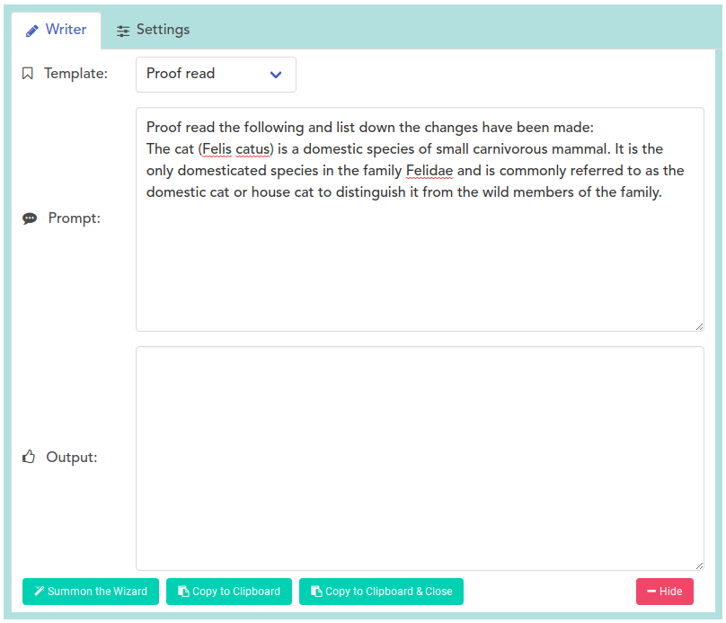

# About WriteZebra: A Linux Launcher App for OpenAI's GPT
WriteZebra is a simple and open-source launcher for Linux that integrates with OpenAI's GPT. It enables users to quickly proofread, summarize, and reply using a hotkey for the selected text in the current active window.

Features:
- Auto-copies the selected text.
- Activated by a keyboard shortcut (Ctrl-Shift-K).
- Unlike Chrome plug-ins, WriteZebra works across all apps, such as browsers and mail clients.
- Customizable templates for proofreading, summarizing, and rewriting emails, among other things.
- Runs on Linux and Windows (coming soon).



## 1. Installation


### Install zlib1g-dev and libpng-dev
zlib1g-dev provides functions for compression and decompression, libpng-dev provides functions for reading and writing PNG files, and libx11-dev and libxtst-dev provide X Window System libraries for graphical applications.
```
sudo apt-get install zlib1g-dev
sudo apt-get install libpng-dev
sudo apt install libx11-dev libxtst-dev
```


### Install dependencies
```
npm install
```

### For Robotjs(Optional)
https://www.electronjs.org/docs/latest/tutorial/using-native-node-modules
```
npm install --save-dev @electron/rebuild

# Every time you run "npm install", run this:
./node_modules/.bin/electron-rebuild
```

### Install xsel for Linux(Optional)
xsel is a command-line tool for working with the X clipboard in Linux. It allows you to manipulate the clipboard contents from the command line.

To install xsel, run the following command:

```
sudo apt install xsel
```

## 2. To start the project

run the following command:
```
npm start
```

This command will run the project and launch it in a new window.